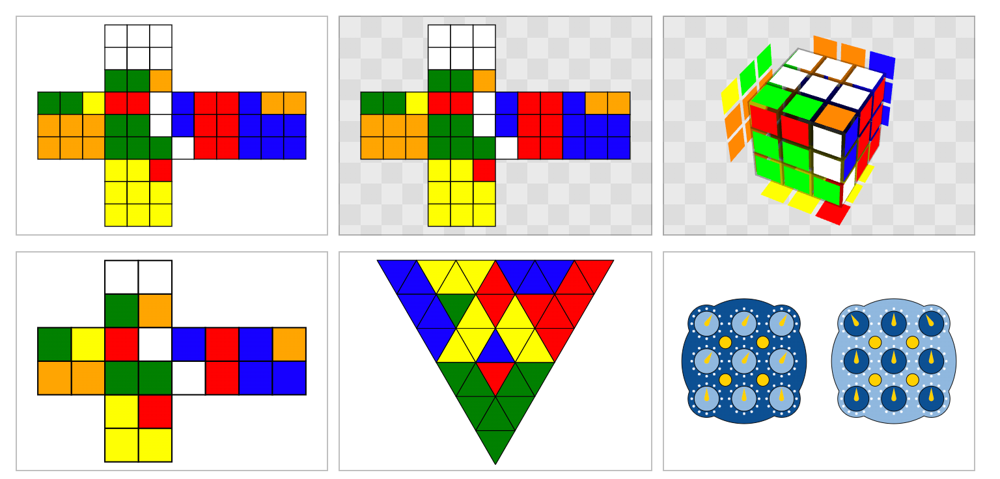

# `<scramble-display>`



`<scramble-display>` is an easy way to display scrambles for twisty puzzles like the [Rubik's Cube](https://en.wikipedia.org/wiki/Rubik%27s_Cube) and [WCA puzzles](https://www.worldcubeassociation.org/) in web sites and apps.

`<scramble-display>` uses [`cubing/twisty`](https://js.cubing.net/cubing/twisty/) from `cubing.js` under the hood, but has some conveniences that you may prefer:

- Using the event ID rather than the puzzle name.
- Displaying just the final scramble in 2D by default.

## Getting Started

Here's a simple file to get you started:

```html
<!-- Include the following line once, preferably in the `<head>` section. -->
<script src="https://cdn.cubing.net/v0/js/scramble-display" type="module"></script>

<!-- Create as many `<scramble-display>` elements as you want, like this. -->
<scramble-display scramble="F' D F2 L2 U' R2 U' F2 D2 R2 F2 U2 F R' B F D' B2 U B'"></scramble-display>
```

This approach is recommended if you're not familiar with `npm`. By loading the library from `cdn.cubing.net`, you will automatically get:

- support for new puzzles,
- new features for users without changing your code (e.g. rotating 3D puzzles),
- bug fixes,
- and upcoming performance improvements (e.g. downloading less code if your page only uses 2D views).

## Specifying options with HTML

To display a 3x3x3 scramble, you only need to specify the `scramble` attribute:

```html
<scramble-display scramble="F' D F2 L2 U' R2 U' F2 D2 R2 F2 U2 F R' B F D' B2 U B'"></scramble-display>
```

You can specify puzzles other than 3x3x3 using the `event` attribute, and optionally set a checkered background:

```html
<scramble-display 
  event="pyram"
  scramble="B U' L U' L B' U' L' l' r u'"
  checkered
></scramble-display>
```

3D is also supported:

```html
<scramble-display
  scramble="F' D F2 L2 U' R2 U' F2 D2 R2 F2 U2 F R' B F D' B2 U B'"
  visualization="3D"
  checkered
></scramble-display>
```

Note: not all puzzles have 3D support yet. See below.

If you change any of the attributes (e.g. using Javascript, or by hand in DevTools), the display will update immediately. This makes it ideal for timers apps that want to show the latest scramble on a part of the screen.

## Use with `npm`

Install using `npm`:

```console
npm install scramble-display
```

In addition to creating or manipulating `<scramble-display>` elements directly in the DOM (everything from the previous section will still work), you can construct custom elements in Javascript:

```js
import { ScrambleDisplay } from "scramble-display"

const el = new ScrambleDisplay();
el.event = "pyram";
el.scramble = "B U' L U' L B' U' L' l' r u'";

document.body.appendChild(el);
```

## Options

You can either specify these as HTML attributes, or set/get properties on the `<scramble-display>` element in Javascript.

```
event: null | "222" | "333" | "444" | "555" | "666" | "777" | "333bf" | "333fm" | "333oh" | "clock" | "minx" | "pyram" | "skewb" | "sq1" | "444bf" | "555bf" | "333mbf" | "333ft";
visualization: null | "2D" | "3D"
scramble: null | string
checkered: false (attribute not present) | true (attribute present)
```

The default size of a `<scramble-display>` is `384px` by `256px`. Use CSS to set the `height` and `width` attributes if you'd like to use a different size, and use `resize` if you'd like to allow the user to resize the element, e.g.

```css
<style>
scramble-display {
  width: 30vh;
  height: 20vh;
  resize: both;
  overflow: hidden;
}
</style>
```

## Suported Events

| Event ID | 2D | 3D | WCA Notation implemented yet? |
| -| -| -| -|
| `222` | ✅ | ✅ | ⚠️¹ |
| `333` | ✅ | ✅ | ⚠️¹ |
| `444` | ✅ | ✅ | ⚠️¹ |
| `555` | ✅ | ✅ | ⚠️¹ |
| `666` | ✅ | ✅ | ⚠️¹ |
| `777` | ✅ | ✅ | ⚠️¹ |
| `333bf` | ✅ | ✅ | ⚠️¹ |
| `333fm` | ✅ | ✅ | ⚠️¹ |
| `333oh` | ✅ | ✅ | ⚠️¹ |
| `clock` | ✅ | ❌ | ✅ |
| `minx` | ✅ | ✅ | ✅ |
| `pyram` | ✅ | ❌ | ✅ |
| `skewb` | ✅ | ✅ | ✅ |
| `sq1` | ✅ | ❌ | ✅ |
| `444bf` | ✅ | ✅ | ⚠¹ |
| `555bf` | ✅ | ✅ | ⚠️¹ |
| `333mbf` | ✅ | ✅ | ⚠️¹ |
| `333ft` | ✅ | ✅ | ⚠️¹ |

¹ Currently accepts all valid WCA notation as well as some non-WCA moves. Support for non-WCA moves may be removed in the future.

Please contribute to help us make this chart 100% green!

## License

This project is licensed under the GPL license (version 3 or later). This means that this library is **free to use**, although you **must publish any code that uses it** (e.g. also put it on GitHub). See [the full license](./LICENSE.md) for exact details.

We've selected this license in order to encourage the cubing community to work on software in a way so that everyone can contribute and extend each other's work.
